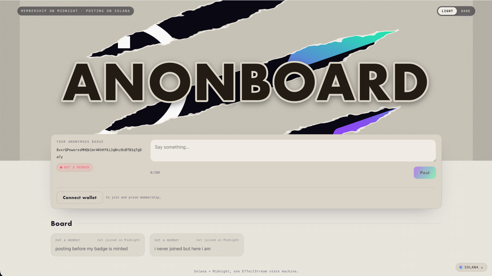

<div align="center">

# solana-anonboard

**Membership proven privately on Midnight · posting public and gasless on Solana.**

<picture>
  <source media="(prefers-color-scheme: dark)" srcset="docs/media/screenshot-dark.png">
  
</picture>

</div>

An anonymous bulletin board: the **right to post is proven in a Compact zero-knowledge circuit on Midnight**, and the **posts themselves live on Solana** (public, gasless). Posting is open to anyone — a post is only *marked as a member's* when its author proved membership, and no post traces back to a person, not even for whoever runs the servers. One [EffectStream](https://effectstream.dev) node reads both chains and ties them together through an anonymous badge. See **[Architecture](docs/architecture.md)** for how it works and why the privacy holds.

> Built on the Midnight Network.

## Quickstart

A full walkthrough on the local `undeployed` chain — from a fresh clone to a post the board marks as a verified member. Everything runs on your machine. (Running against a hosted TestNet? See **[Other networks](#other-networks-preview--preprod)** below.)

**Prerequisites** — [Bun](https://bun.sh) ≥ 1.3, **Docker** (with Compose v2) running — the local Midnight chain is a Docker localnet, so the daemon must be up before `bun run dev` — **Rust** (`rustup`; `cargo-build-sbf` drives it to build the Solana program), a **C toolchain** (macOS: `xcode-select --install`; Debian/Ubuntu: `apt install build-essential`), and the **Compact compiler** (the contract compiles at boot; the artifact isn't committed):

```bash
curl --proto '=https' --tlsv1.2 -sSf https://sh.rustup.rs | sh                                             # Rust
curl --proto '=https' --tlsv1.2 -LsSf https://github.com/midnightntwrk/compact/releases/latest/download/compact-installer.sh | sh   # Compact
```

**1. Start the stack.**

```bash
bun install
bun run dev            # the local `undeployed` chain — everything runs on your machine
```

`bun run dev` asks two quick questions on startup — each auto-picks a safe default after 20s, so pressing **Enter** through both is fine:

- **Reuse the contract?** — appears only on a re-run (when one's already deployed): **Enter** reuses it, `n` deploys fresh.
- **Solana network?** — pick **`L` (local validator)**: fully local, posts reset each run (`d` uses persistent devnet).

The local Midnight chain runs as a **Docker localnet** (node/indexer/proof containers, brought up automatically). The first cold start pulls those images, downloads the Solana toolchain, compiles the Rust program + Compact circuit, and waits for dust to accrue — give it a few minutes; the **Contract deploy** step alone can take ~160s. At the **`✓ anonboard is ready`** banner, open **http://localhost:5173** — you'll see *your anonymous badge*, a red **● NOT A MEMBER** tag, and an empty **Board**. You can read, but you're not verified yet. Each `bun run dev` starts from a fresh chain (stopping the stack tears the localnet down), so every run redeploys.

**2. Start the mn CLI wallet.** Browser wallet connect has open issues on the local chain ([#1](https://github.com/nel349/solana-anonboard/issues/1)), so the reliable local wallet is `mn` (midnight-wallet-cli). It's already a project dependency — run it with **`bunx mn` from the repo directory** (no global install). In a second terminal (in the repo):

```bash
bunx mn wallet generate demo
bunx mn airdrop 1000 --wallet demo --network undeployed      # fund it on the localnet
bunx mn dust register --wallet demo --network undeployed     # so it can pay the Midnight fee (dust)
bunx mn serve --wallet demo --network undeployed --approve-all
```

It prints `Server ready — listening on ws://localhost:9932`. (Full detail + troubleshooting: [Using the mn CLI wallet](docs/mn-wallet.md).)

**3. Join and post.** In the app, click **Connect wallet → mn CLI wallet (local)**, then **Join** — the browser proves membership in the Compact ZK circuit (your secret never leaves the page), the mn wallet pays the fee, and once the node syncs your badge flips to a green **● MEMBER**. Type a message and **Post**: it lands on the **Board** labeled **member · joined on Midnight** — gasless, settled on Solana, provably from a member without revealing which one. (A post from a badge that never joined shows **not a member** — that's the check working.)

Inspect the raw feed any time with `curl -s localhost:9999/api/posts`, and stop everything with `bun run dev:stop`. (Prefer no browser? `bun run scripts/demo.ts` runs the whole loop headless.)

| Service | URL |
|---|---|
| Frontend | http://localhost:5173 |
| Sync node API | http://localhost:9999/api/posts · `/api/badges` |
| Batcher (fee-payer) | http://localhost:3334 |
| Operator | http://localhost:3335 |
| Midnight localnet (Docker: node / indexer / proof) | :9944 · :8088 · :6300 |
| mn CLI wallet (optional, `mn serve`) | ws://localhost:9932 — see [Using the mn CLI wallet](docs/mn-wallet.md) |

Manage a running stack from any terminal: `bun run dev:status`, `bun run dev:logs`, `bun run dev:stop`. Full workflow and troubleshooting in **[Development](docs/development.md)**.

## Other networks (preview / preprod)

`bun run dev` is the default and runs entirely locally. To run against a hosted Midnight TestNet instead, use `bun run dev:preview` or `bun run dev:preprod`. Hosted nets need two things the local chain provides for free — a **funded payer wallet** and a **roster owner key** — and on **preprod** the [mn CLI wallet](docs/mn-wallet.md) is the reliable way to Join (a browser wallet's dust sync lags the large chain). The complete setup — the two keys, funding at the faucet, and endpoints — is in **[Networks & accounts](docs/networks-and-accounts.md)**.

## Documentation

- **[Architecture](docs/architecture.md)** — the two-chain design, the membership circuit, and the privacy guarantee.
- **[Networks & accounts](docs/networks-and-accounts.md)** — running on undeployed / preview / preprod, the two keys (payer wallet + roster owner), funding, and endpoints.
- **[Using the mn CLI wallet](docs/mn-wallet.md)** — the browser-wallet path for `undeployed` and preprod, via `mn serve`.
- **[Development](docs/development.md)** — the `dev:*` commands, headless scripts, tests, and troubleshooting.

## Verified against

The contract compiles and the loop runs end-to-end (verified 2026-08-24 — E2E suite green, 24/24, on mn 0.5.1) against:

| Component | Version |
|---|---|
| Compact compiler / language | 0.31.0 / 0.23.0 |
| `@midnight-ntwrk/compact-runtime` | 0.16.0 |
| `@midnight-ntwrk/ledger-v8` | 8.1.0 |
| `@midnight-ntwrk/midnight-js-*` | 4.1.1 |
| EffectStream | 0.102.0 |
| `midnight-wallet-cli` (`mn`) | 0.5.1 (needs `dust export`) |
| Midnight localnet (Docker, via `mn localnet up`) | node 1.0.0 · indexer-standalone 4.3.3 · proof-server 8.1.0 |

## Scope and limitations

This is an example on a dev chain, not a production build:

- **Dev-only trust:** a single funded operator wallet, permissive CORS, and no auth. The membership secret lives in the browser's `localStorage` for the demo — a real build must encrypt it.
- **Open roster:** the ZK guarantees a post is from *a roster member* — but roster admission is not gated in the demo. The operator's `/register` (and owner-only `add_to_roster`) admit anyone who asks, so one person can mint many badges. The privacy holds regardless; "membership" is only as meaningful as the admission policy a real build puts in front of `add_to_roster`.
- **Dev keys:** the Solana batcher fee-payer and program keypairs are **generated per clone** (gitignored, not committed). The fixed Midnight owner key (`packages/contracts-midnight/owner-key.ts`) is committed on purpose so the localnet demo runs out of the box; its secret is public and must **never** be funded or deployed on a real network. `deploy` and the operator refuse to run with the committed owner key on any network other than `undeployed`.
- **State persistence:** on `undeployed` a fresh `bun run dev` resets both chains to slot 0. On **devnet/preprod** the Solana program and its posts are persistent by design — a Midnight redeploy resets *membership* only, not the posts (which live in Solana accounts) or your badge (which lives in `localStorage`).
- **Cross-chain ordering:** Midnight's sync catches up from block 1 while Solana is already current, so a post can arrive before its badge. The arbiter holds it and backfills to accepted once the badge lands (the `reason` string records which path a post took).

## Acknowledgements

This project stands on significant open-source work. See [NOTICE](./NOTICE) for the full attribution; in short:

- **[EffectStream](https://github.com/effectstream/effectstream)** (MIT OR Apache-2.0) — the sync-node framework this is built on. Forked from its `solana-starter` template; the Solana round-trip, batcher, and frontend scaffolding are adapted from it.
- **[midnight-rs](https://github.com/Moonsong-Labs/midnight-rs)** by Moonsong Labs (MIT) — the Rust SDK for Midnight; the ledger and proving used here (via `@midnight-ntwrk/ledger-v8`) are built from it.
- **[Midnight JS SDK](https://github.com/midnight-ntwrk)** & **[Compact](https://github.com/LFDT-Minokawa/compact)** (Apache-2.0) — wallet, indexer, and zero-knowledge contract tooling.
- **[Solana web3.js](https://github.com/solana-labs)** (Apache-2.0) — the public, gasless posting/settlement layer.

Licensed under [Apache-2.0](./LICENSE).
